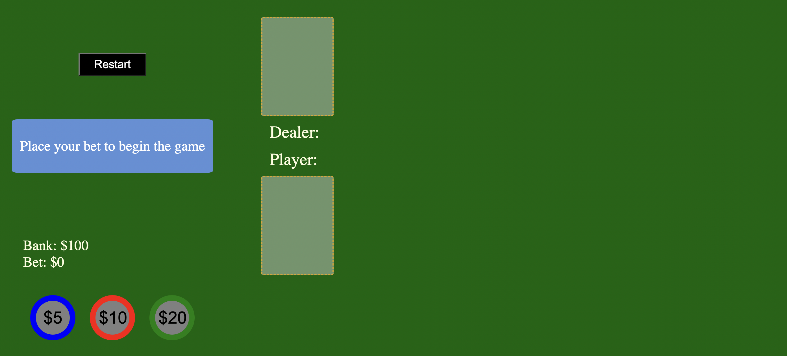
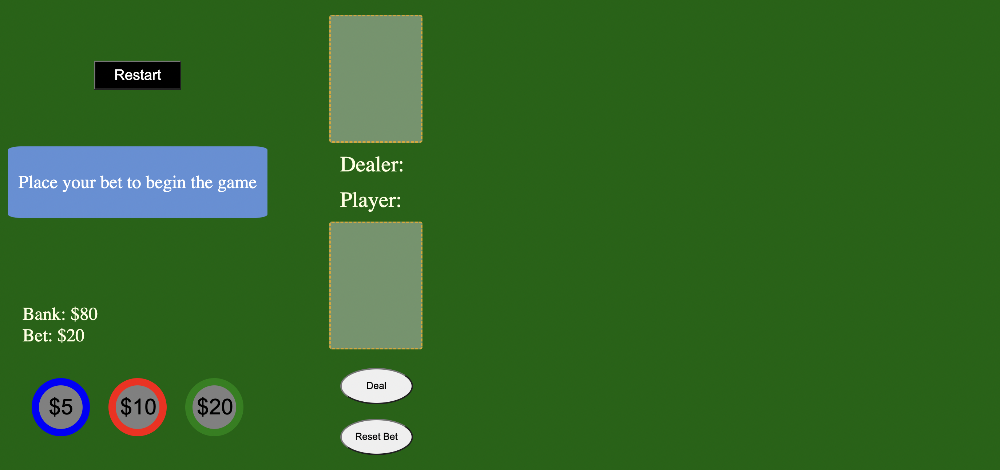
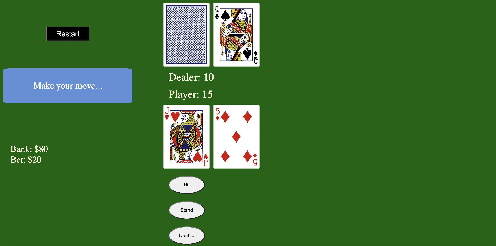
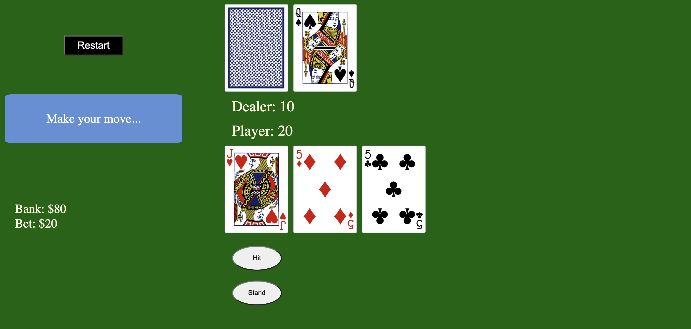
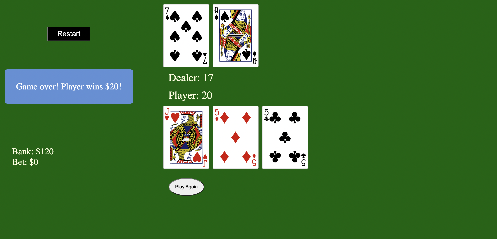
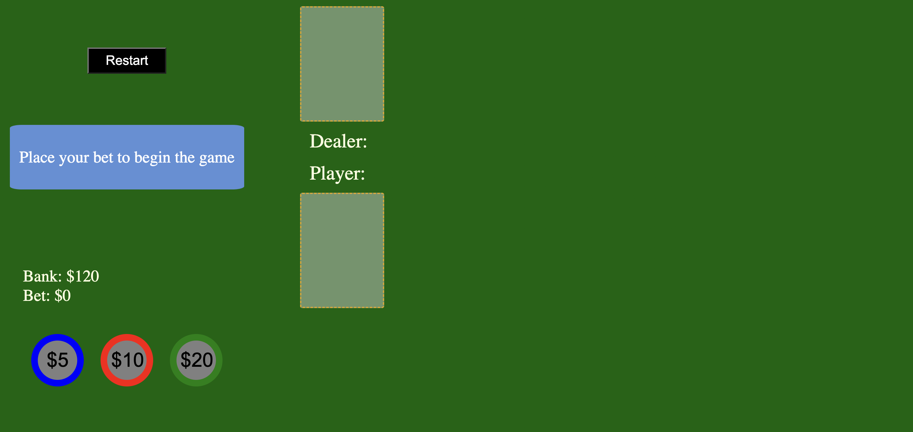
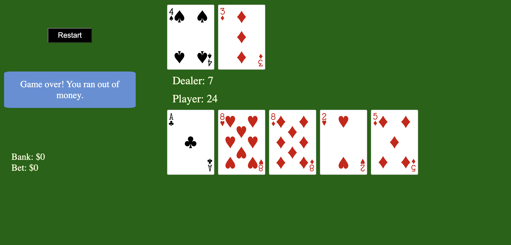

# Blackjack CDG

Link to Game: https://cdgrody.github.io/blackjackCDG/

## Technologies Used
- javascript
- HTML
- CSS

## Description
Blackjack is a card game played with 6 decks of 52 cards. The objective of the game is to beat the dealer by having a hand value of 21 or as close to 21 as possible without going over. Players place a bet within the limits of their bank and are then dealt two cards. They can choose to "hit" and receive additional cards or "stand" with their current hand or "double" which doubles their bet and draws only one additional card. The dealer must hit on a hand value of 16 or less.

## Getting Started
1. Place a bet within the limits of your bank by clicking one or more chips.
2. Press the "Deal" button to receive two cards.
3. Choose to "hit," "stand," or "double."
4. If neither player nor dealer busts, the final values will be compared and a winner or draw will be determined.
5. If the player wins, 2x the bet is added to their account. If the player loses, the bet is taken away. If the player and dealer tie, the original bet amount is added back to the bank.
6. Press the "Play Again" button to start a new hand. The deck will not be regenerated until all the cards are used.
7. Press the "Restart" button at any time to reset the bank, regenerate, and reshuffle the deck.

## Next Steps
- Fix glitches associated with the payout for the player when the player gets blackjack.
- Add logic for dealer to hit on soft 17.
- Add logic for player to split hand when the first draw cards are the same value (split up to 3 times on the same hand).
- Improve styling to show a table and display the rules.
- Add an option for the player to split the hand when the initial draw reveals two cards of the same value.
- Incorporate a "hint" box where the player can hover their cursor and see the recommended move based on blackjack strategy tables.
- Create an "auto" player option where the statistically recommended move is implemented after the hand is dealt.
- Automate a betting algorithm that defines betting strategies based on the player's bank and previous hands.
- Add the option for the player to play with multiple hands at the same time.

## Screenshots

## Contributors
[cdgrody](https://github.com/cdgrody)

